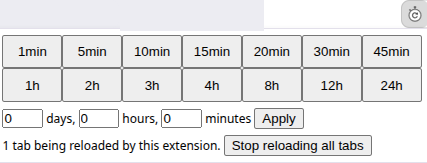

Tab auto reloader (Chrome extension) - BW Fork 
====================================



## About this fork

This is a fork of [denilsonsa/crx-reload-tab](https://github.com/denilsonsa/crx-reload-tab)

It's currently in testing so beware this is not polished as I would like.

### Reason for the fork

I was looking for simple automatic tab reloader based on a timed interval without malware. I wanted to be sure of it being malware free by looking at the source code.  I came across [crx-reload-tab on Reddit](https://www.reddit.com/r/chrome/comments/i1l78e/are_there_any_legit_auto_refresh_extensions_in/) but in 2026 the chrome extension web store said it no longer met the standards and was removed from the store.

Looking into the issue, this browser plugin was based on Chrome extension manifest version 2.  In January 2026 when I was looking at this extension, manifest version 2 has been deprecated in Chrome browsers, chrome no longer allows extensions with manifest version 2 to be installed from the web store or in developer mode.

### Functional Changes 

This fork changes the plugin to manifest version 3.  This did changed the browser API the code was expecting so it's been re-architected.  Though I never used the original version I believe this version is functionally similar with the exception of allowing the amounts of time between refreshes for under 1 minute. Understandably for the original developers purposes this was unacceptable, however for my purposes its fine.

Tech Note: **Persistent background page** implementation has been removed. That functionality is deprecated in chrome, instead this fork uses the Alarms API, which only allows 1 minute minimum refresh.

### Name and extention version changes

As to reduce any confusion between the original extension and this one I have decided to rename several artifacts from `crx-reload-tab` to `bw-reload-tab`.

Since the original extension appears to be no longer under development and the initial version of this fork is a major breaking change, I am starting this fork with version `2.0.0`.  I will also be implementing [Semantic Versioning 2.0.0](https://semver.org/) for a version scheme.

### Installation

As of now this version / fork is not available in the Chrome Web Store.  The prior fork is no longer installable on Modern Chrome browsers. I also do not have releases either, installation is currently manual.

1. Obtain the code base:
   1. Via git:

       ```console
       git clone https://github.com/billwheatley/bw-reload-tab.git
       ```

   1. Via zip file:
       1. Download the Git Hub Repo [zip file](https://github.com/billwheatley/bw-reload-tab/archive/refs/heads/master.zip)
       1. Unzip in a local directory
1. From your downloaded codebase run:

    ```console
    ./make_zip.sh
    ```

1. Open your chrome based web browser **Manage Extensions** settings and enable **Developer mode**:
    1. Open your main menu, Depending on the the Chromium variant, platform and UI styling of the week this might be the hamburger (three horizontal lines) or 3 vertical dots or possibly something else.
    1. Chose `Extensions -> Manage Extensions`, a settings tab should open up.
        1. You could also access this via links like:
            * [chrome://extensions/](chrome://extensions/)
            * [brave://extensions/](brave://extensions/)
    1. Toggle on "Developer mode" in the upper right corner
1. Open a file manager and Drag the `bw-reload-tab.zip` file (produced from the command above) into the middle of the Manage Extensions settings tab.
1. Select or open the tab you want to auto reload with (tabs are configured individually)
1. Open the extension menu, which is a puzzle piece icon, usually to the right of the address bar.
    1. (Optional) Pin the "Tab Auto Reloader", if you want quicker access (you will not have to click the puzzle piece in the future to access it this way)
    1. Select "Tab Auto Reloader" (or the new timer icon if pinned)
    1. Select or type the amount of time you need between reloads.
1. NOTE: currently the refresh settings do not survive browser restarts

### Commitment to: Free, Open and Malware Free Extensions

As was likely the original projects intentions, this is malware free as far as I can tell. Malware is a big problem with these browser extensions.  Often times people just click allow access to these extensions to allow the extensions to work and now the extensions have full access to read and modify everything in the browser.  Often times the developer may start out with good or at least neutral intentions but money comes into play and malware goes in. With automatic updates in the chrome web store you have the malware running on your browser: stealing data, pulling down extra ads, changing links, etc and you probably forgotten about giving full permissions to the extension back when the developer was trustworthy.

As such this extensions does not ask for permissions to view and modify webpages. If it does you have gotten a modified version. Also since it's not currently in the Chrome Web store, there are no automatic updates (if I add it to the web store in the future, you would have to manually add it from the web store first).  All the source code when downloaded from here is viewable and you can see is sourced from here.

## Orignial Project README

*I have made some updates and notes to be clear, certain sections that are no longer relevant have been removed*

[Donation (to original developer) - buy me a coffee](https://denilson.sa.nom.br/donate.html)

Chrome extension to reload the current tab at a chosen interval. [See the original on Chrome Web Store!][cws] (NOTE: Extension is out of date and can't be installed on modern chrome browsers)

Features:

* Free and open-source.
* No (extra) permissions required.
* Easy-to-use.
* The reload interval can be different for each tab.

The icon is a remix of public-domain cliparts [stopwatch by
markroth8][stopwatch] and [Reload icon by mlampret][reload].

Technical stuff
---------------

### Icon badge and Chrome event listeners

The small text below the icon is called [badge][]. When the [badge text is
set][setBadgeText] to a single tab, the badge gets reset whenever the tab loads
another page (or reloads the same page).

For that reason, the extension adds a listener to
[`chrome.tabs.onUpdated`][onUpdated] to restore the badge text after reloading.

In addition, the extension adds a listener to
[`chrome.tabs.onRemoved`][onRemoved] to clear the reload whenever a tab gets
closed.

The extension is smart enough to remove the listeners if no tab is being
auto-reloaded.

[cws]: https://chrome.google.com/webstore/detail/knnahnemielbnanghaphjgheamgcjjcb
[reload]: https://openclipart.org/detail/171074/reload-icon
[stopwatch]: https://openclipart.org/detail/173421/stopwatch
[badge]: https://developer.chrome.com/extensions/browserAction#badge
[setBadgeText]: https://developer.chrome.com/extensions/browserAction#method-setBadgeText
[onUpdated]: https://developer.chrome.com/extensions/tabs#event-onUpdated
[onRemoved]: https://developer.chrome.com/extensions/tabs#event-onRemoved
